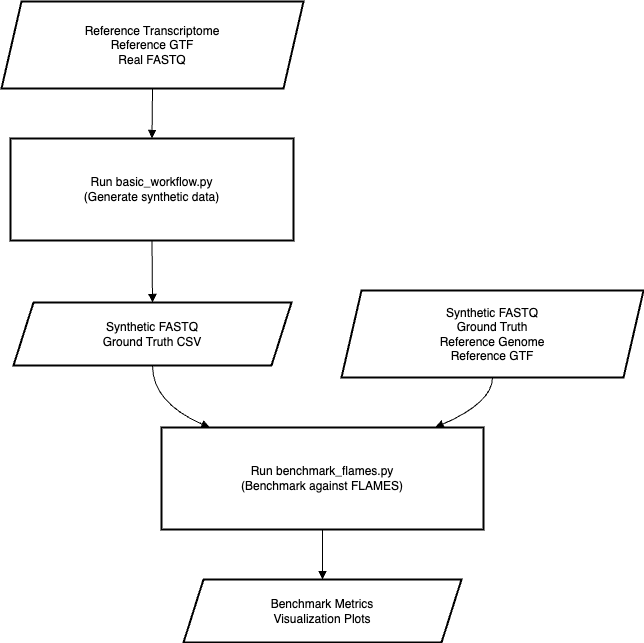

# SynthLongReadSc

A Python framework for generating synthetic long-read scRNA-seq data with realistic error profiles for benchmarking analysis tools.



## Overview

SynthLongRead is a machine learning-based framework that learns error patterns from real long-read sequencing data (Oxford Nanopore or PacBio) and produces synthetic FASTQ files with realistic error profiles. The synthetic data preserves the technical characteristics of the original data while providing a ground truth reference for benchmarking bioinformatics tools.

### Key Features

- **Data-driven approach**: Learns error patterns directly from your real data
- **Neural network models**: Captures sequence-dependent error profiles
- **Realistic isoform expression**: Generates cell-specific transcript expression patterns
- **Internal priming simulation**: Models common library preparation artifacts
- **Comprehensive benchmarking**: Evaluates tool performance against known ground truth
- **User-friendly configuration**: YAML-based configuration system

## Installation

```bash
# Clone the repository
git clone https://github.com/manveerchauhan/SynthLongReadSc.git
cd SynthLongRead

# Install dependencies
pip install -r requirements.txt

# Install the package
pip install -e .
```

### Prerequisites

- Python 3.8 or higher
- Minimap2 (for read alignment)
- Samtools (for BAM processing)
- PyTorch (for neural network models)
- FLAMES (optional, for benchmarking)

## Getting Started

### Quick Start with Command Line

```bash
# Create a template configuration
python synthlongread_cli.py create-template --output my_config.yaml

# Edit the configuration with your input files
# Then run SynthLongRead
python synthlongread_cli.py run --config my_config.yaml
```

### Quick Start with Python

```python
from synthlongread import SynthLongRead

# Initialize SynthLongRead
synth = SynthLongRead(
    reference_transcriptome="reference.fa",
    reference_gtf="annotation.gtf",
    platform="ONT"
)

# Learn from real data
synth.learn_from_real_data(real_fastq="real_data.fastq")

# Generate synthetic dataset
synthetic_fastq, ground_truth = synth.generate_synthetic_dataset(
    n_cells=100,
    max_reads=100000
)

print(f"Generated synthetic data: {synthetic_fastq}")
print(f"Ground truth: {ground_truth}")
```

## Using Configuration Files

SynthLongRead supports YAML configuration files to make the pipeline more accessible and reproducible.

### Creating a Configuration Template

```bash
python synthlongread_cli.py create-template --output my_config.yaml
```

### Configuration Example

```yaml
# Input files
input:
  reference_transcriptome: "/path/to/transcriptome.fa"
  reference_gtf: "/path/to/annotation.gtf"
  real_fastq: "/path/to/real_data.fastq"
  reference_genome: "/path/to/genome.fa"  # Optional, for FLAMES

# Output settings
output:
  directory: "./synthlongread_output"
  overwrite: true

# Sequencing platform settings
platform:
  type: "ONT"  # "ONT" or "PacBio"
  is_single_nucleus: false
  adapter_5p: "CCCATGTACTCTGCGTTGATACCACTGCTT"
  adapter_3p: "AAAAAAAAAAAAAAAAAA"

# Synthetic dataset parameters
dataset:
  n_cells: 100
  sparsity: 0.8
  max_reads: 100000

# Error modeling parameters
error_model:
  context_size: 5
  load_existing: false
  model_dir: null

# Internal priming simulation
internal_priming:
  enabled: false
  rate: null  # Auto-infer if null
  min_a_content: 0.65
  window_size: 10
  infer_from_data: true

# Benchmarking options
benchmark:
  run_flames: false
  evaluate_internal_priming: false
  flames_path: "flames"

# Performance settings
performance:
  threads: 4
  device: "auto"
  seed: 42
```

### Running with Configuration File

```bash
python synthlongread_cli.py run --config my_config.yaml
```

## How SynthLongRead Works

### Learning from Real Data

SynthLongRead extracts error profiles from real long-read data:

1. **Alignment**: Aligns reads to reference transcriptome using Minimap2
2. **Error Profiling**: Identifies patterns of substitutions, insertions, and deletions
3. **Context Dependency**: Captures how surrounding sequence affects error rates
4. **Quality Modeling**: Learns the relationship between error types and quality scores

### Error Modeling with Neural Networks

SynthLongRead uses two neural networks to model errors:

1. **Sequence Error Model**: Predicts error probabilities based on sequence context
   - Input: 5-base window (sequence context)
   - Output: Probabilities for match, substitution, or deletion

2. **Quality Score Model**: Predicts quality scores for each base
   - Input: Sequence context + error type + position
   - Output: Phred quality score

These models capture the complex, sequence-dependent nature of errors in long-read sequencing.

### Synthetic Read Generation

The framework generates reads with realistic error patterns:

1. **Expression Matrix**: Creates a cell-by-transcript matrix of expression levels
2. **Read Generation**: For each transcript in each cell:
   - Samples read length from learned distribution
   - Adds cell barcodes and protocol-specific adapters
   - Introduces sequence-dependent errors using trained models
   - Assigns realistic quality scores

### Ground Truth Tracking

Every synthetic read maintains a connection to its source information:
- Original transcript
- Cell barcode
- Expression level
- Position within transcript
- Any artificial errors introduced

This ground truth enables precise evaluation of analysis tool performance.

## Internal Priming Simulation

SynthLongRead includes the ability to simulate internal priming artifacts, a common source of bias in long-read RNA-seq data.

### What is Internal Priming?

Internal priming occurs when oligo(dT) primers bind to A-rich regions within transcripts rather than solely at the true poly(A) tail, creating truncated cDNAs with artificial 3' ends.

### Using Internal Priming Simulation

Enable internal priming in your configuration:

```yaml
internal_priming:
  enabled: true
  rate: null  # Auto-infer from data
  min_a_content: 0.65
  window_size: 10
  infer_from_data: true
```

Or through code:

```python
synth = SynthLongRead(
    reference_transcriptome="transcriptome.fa",
    reference_gtf="annotation.gtf",
    internal_priming=True,
    internal_priming_rate=0.15
)

# Infer internal priming patterns from real data
synth.learn_from_real_data(
    real_fastq="data.fastq",
    infer_internal_priming=True
)
```

## Benchmarking Tools

SynthLongRead provides comprehensive benchmarking functionality to evaluate tool performance.

### Benchmarking FLAMES

```bash
python synthlongread_cli.py benchmark \
  --synthetic-fastq synthetic_data.fastq \
  --ground-truth ground_truth.csv \
  --reference-genome genome.fa \
  --reference-gtf annotation.gtf \
  --output-dir ./benchmark_results
```

### Validation Against Real Data

```bash
python synthlongread_cli.py validate \
  --synthetic-fastq synthetic_data.fastq \
  --real-fastq real_data.fastq \
  --output-dir ./validation_results
```

### Evaluation Metrics

SynthLongRead calculates multiple metrics to evaluate tool performance:

- **Detection Metrics**: Precision, recall, F1-score for transcript detection
- **Quantification Metrics**: Correlation, RMSE, MAE for abundance estimation
- **Isoform Ratios**: Accuracy of relative isoform usage within genes
- **Internal Priming Effect**: Separate evaluation for internally primed transcripts

## Advanced Usage Examples

### Custom Expression Patterns

```python
from synthlongread import SynthLongRead

# Initialize SynthLongRead
synth = SynthLongRead(
    reference_transcriptome="reference.fa",
    reference_gtf="annotation.gtf"
)

# Learn from real data
synth.learn_from_real_data(real_fastq="real_data.fastq")

# Create custom expression matrix
custom_cell_matrix = {
    "cell_1": {"ENST0001": 10, "ENST0002": 5},
    "cell_2": {"ENST0001": 0, "ENST0002": 8}
}

# Generate dataset from custom matrix
ground_truth = synth.fastq_generator.generate_dataset(
    custom_cell_matrix, 
    "custom_dataset.fastq"
)
```

### Running on HPC Environment

For large datasets, configure performance settings:

```yaml
performance:
  threads: 16
  device: "cuda"
  seed: 42
```

## Troubleshooting

### Common Issues

1. **Memory errors**:
   - Reduce `max_reads` to generate fewer reads
   - Run on a machine with more RAM
   - Use the `--max-reads` CLI option to limit read count

2. **Runtime issues**:
   - Increase `threads` in the configuration
   - Use GPU acceleration by setting `device: "cuda"`
   - Consider running on an HPC system

3. **Alignment errors**:
   - Ensure reference files are compatible versions
   - Check that minimap2 and samtools are in your PATH
   - Try providing a pre-aligned BAM with `alignment_file`

4. **Error profile issues**:
   - Ensure input FASTQ has enough reads (10,000+ recommended)
   - Check if platform setting matches your data

## Citing SynthLongRead

If you use SynthLongRead in your research, please cite:

```
[Citation information will be added after publication]
```

## Contributing

Contributions are welcome! Please feel free to submit a Pull Request.
Feel free to contact me for questions/suggestions: mschauhan@student.unimelb.edu.au


## How Our Error Models Work

SynthLongRead uses a sequence context-based approach to model and reproduce sequencing errors. Here's a technical explanation of how the models operate:

### The 5-Base Window Approach

We model errors using a sliding window of 5 consecutive bases:

```
    ↓ Center base
  ACGTT
  12345
```

1. For each position in a read, we examine the 5-base context (the center base and 2 bases on each side)
2. This context is converted to a numerical representation (one-hot encoding):
   - A = [1,0,0,0]
   - C = [0,1,0,0]
   - G = [0,0,1,0]
   - T = [0,0,0,1]
3. For example, "ACGTT" becomes a 20-feature vector: [1,0,0,0,0,1,0,0,0,0,1,0,0,0,0,1,0,0,0,1]

### Model Training Process

We train our models on millions of these examples from real data:

1. **Data Collection**: For each aligned base in real data, we record:
   - The 5-base context
   - What actually happened (match, substitution to which base, deletion)
   - The quality score assigned
   - The relative position in the read

2. **Neural Network Training**: Our models learn the relationship between:
   - Input: 5-base context + position
   - Output: Probabilities of different error types

### Additional Information

## How Synthetic Reads Are Generated

The read generation process works like this:

1. **Start with Perfect Sequence**: 
   - Begin with the correct transcript sequence from the reference

2. **Process Base-by-Base**:
   - For each base position, extract the 5-base context
   - Feed this context into our error model
   - The model outputs probabilities for different outcomes:
     ```
     Match (correct read): 95.2%
     Substitution to A: 1.2%
     Substitution to C: 0.8%
     Substitution to G: 0.5%
     Substitution to T: 0.3%
     Deletion: 2.0%
     ```
   - Randomly sample an outcome based on these probabilities
   - Apply the selected error (or keep the base if "match" is selected)
   - Use our quality score model to assign a realistic quality score

3. **Handle Insertions Separately**:
   - After processing each base, determine if an insertion should occur
   - If yes, insert a random base with appropriate quality score

## Example of Model in Action

Here's a simplified example of how a read might be processed:

Original transcript fragment: `AACGTACGT`

Processing steps:
1. Consider context `AACGT` (center base C)
   - Model predicts 97% match, 2% substitution, 1% deletion
   - Random sample selects "match"
   - Keep C, assign quality score Q30

2. Consider context `ACGTA` (center base G)
   - Model predicts 80% match, 15% substitution, 5% deletion
   - Random sample selects "substitution to T"
   - Replace G with T, assign quality score Q18

3. Continue through the sequence...

Resulting read: `AACTACGT` (with one substitution)

This approach reproduces the specific error patterns of your sequencing technology, including homopolymer errors, sequence-specific biases, and position-dependent error rates.

